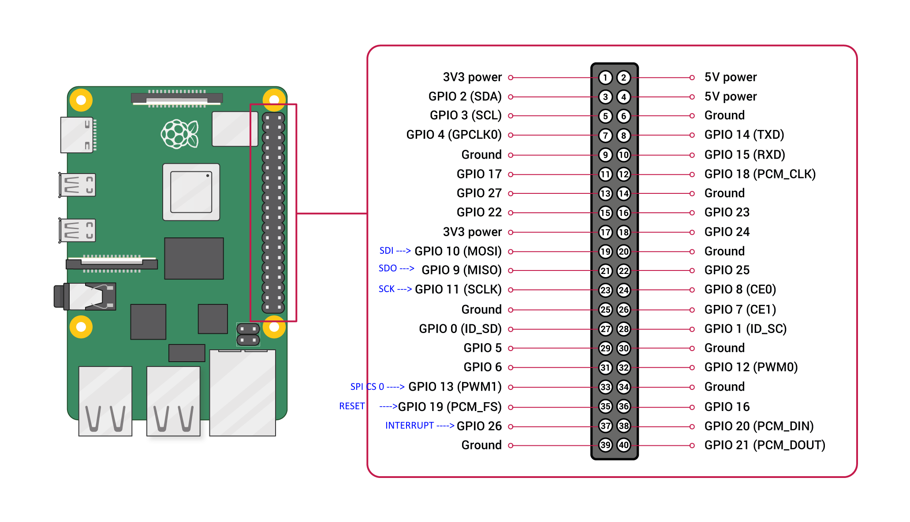

OVERVIEW
--------


*riverdi-eve* project is an easy-to-use C library and example app (good starting point for your own projects) for the Bridgetek’s [*FT8XX EVE (Embedded Video Engine)*](http://brtchip.com/eve/) solutions:

- __EVE 1__ series: FT800 and FT801,
- __EVE 2__ series: FT810, FT811, FT812 and FT813,
- __EVE 3__ series: BT815 and BT816,
- __EVE 4__ series: BT817 and BT818

The library contains support for the most popular hardware/software platforms like:

* __Raspberry Pi__ (and other linux-based Single Board Computers),

Library supports instructions in a similar format to the *FT80x and FT81x Series Programmers Guides* and the *EVE Screen Editor*. 

LIBRARY ARCHITECTURE
--------------------

#### Example App

The *riverdi-demo.c* file can be edited to produce the final application, calling the functions from the underlying layers.

#### API Layer

This layer is designed to allow the main application to use syntax close to that of the *FT80X/FT81X Programmers Guide* and make it more user friendly. The functions provided in this layer handle co-processor operation and assist with creating and executing co-processor lists as well as keeping track of the offset within the FIFO for each command and sending parameters of commands such as text strings.

#### EVE Layer

This layer translates the calls from the API layer above into a series of SPI byte transfers formatted for the protocol used by the FT8XX. It includes a series of functions which send the register address as well as for reading and writing 8/16/32-bit values. It also has functions for checking the read and write pointers of the RAM_CMD FIFO and for checking the free space available, which are used by the layers above. 

#### Host Layer

This layer provides an interface to the hardware. It takes the SPI transfers from the EVE layer and translates them into the low-level operations (SPI and GPIO operations for chip select and power down).

If porting the provided code to another type of hardware/software platform, the code in *host_layer* directory should be customized to match the peripheral API of the chosen platform whilst keeping the same syntax for calls to this layer from the EVE layer above.

COMPILING LIBRARY
-----------------

The *riverdi-eve* project uses a standard Makefile and GNU make to build and customize the source files for all supported platforms.

__Note:__ *before compilation edit Makefile.linux file to choose Embedded Video Engine series (-DEVE_1, -DEVE_2 or -DEVE_3 flags), choose type and size of connected TFT module (choose predefined macros for Riverdi EVE modules or edit timings manually in modules.h file for custom displays) or to adjust compilation settings.*  

#### Raspberry Pi / Linux SBCs

1. Clone the repository (if you haven't done so already):
```
git clone https://github.com/riverdi/riverdi-eve.git
```
2. Change directory to the repository folder:
```
cd riverdi-eve
```
3. Build *riverdi-eve* project:
```
make -f Makefile.linux
```

#### Hardware Setup
[Riverdi Click Interface Board](https://www.mikroe.com/riverdi-click)
The Riverdi Click breaks out the ZIF20 connections into easily accessibly pins, the main ones used for Raspberry Pi are as depicted:



GETTING HELP
------------

Please contact Riverdi support - [*<support@riverdi.com>*](support@riverdi.com)

LICENSE
-------

See LICENSE.txt file for details.
